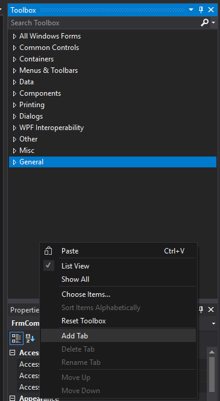
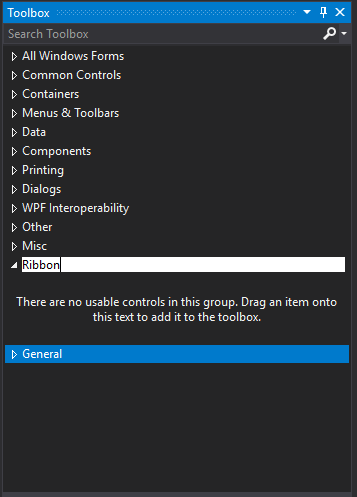
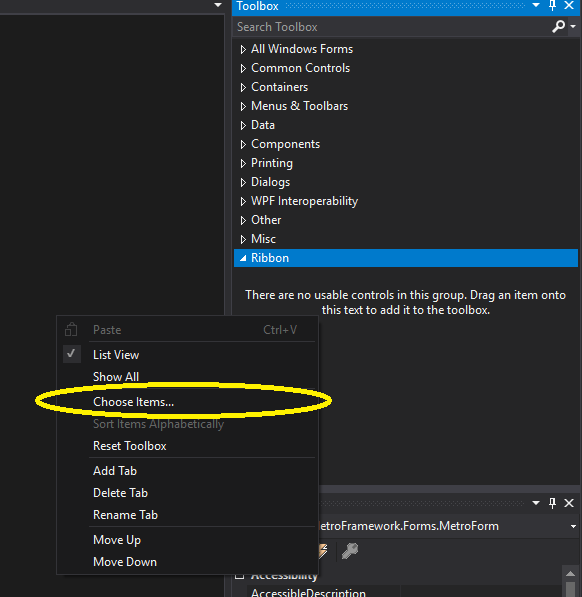
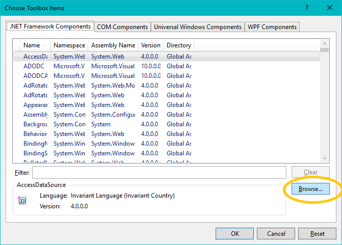
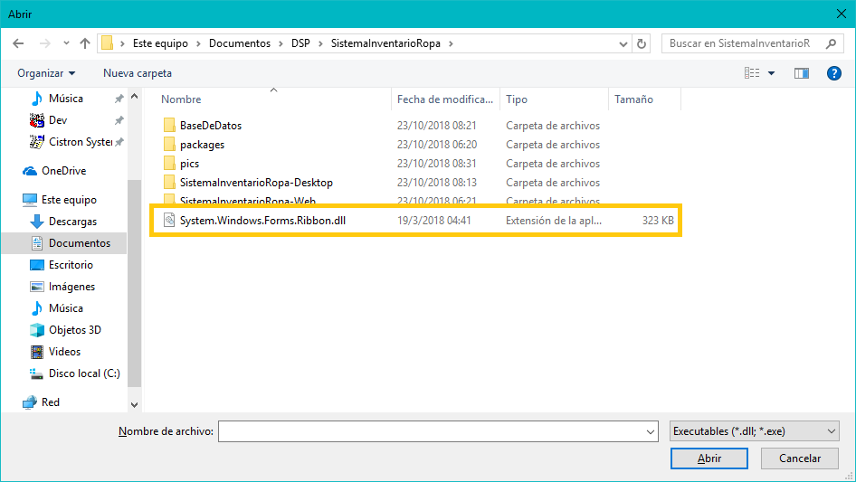
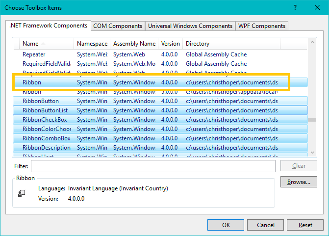

# IMPORTANTE!

**Este proyecto fue realizado con Visual Studio 2017 con .NET Framework 4.5**

Antes de abrir este proyecto de Visual Studio se necesita instalar la DLL 
`System.Windows.Forms.Ribbon.dll` ubicado en el directorio raiz y `MetroFramework.dll` en
`packages\MetroModernUI.1.4.0.0\lib\net\MetroFramework.dll`

y a Visual Studio antes de continuar de la siguiente manera:

**1: Agregar una nueva pestaña en la Caja de Herramientas**

**2: Nombrarlo como Ribbon**

**3: Seleccionar Items**

**4: Buscar nuestra dll a traves de este boton:**

**5: En la carpeta raíz del la solución se encontrará nuestra DLL deseada**

**6: Seleccionar solo el control "Ribbon" ya que es el unico que necesitamos y damos Aceptar**

**7: El ribbon ya estará presente**

**NOTA: Realizar este mismo proceso (pero seleccionando todos los controles Metro nuevos) con la DLL MetroFramework.dll ubicado en `packages\MetroModernUI.1.4.0.0\lib\net\MetroFramework.dll`
